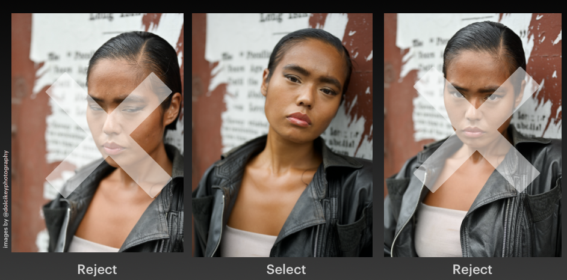
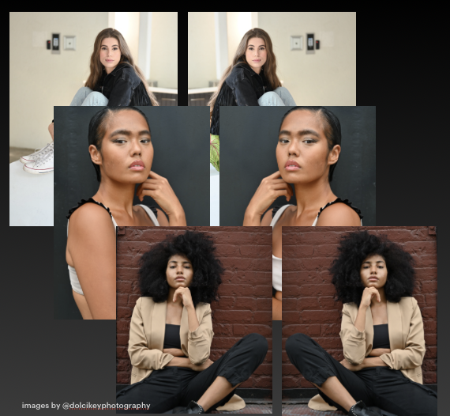
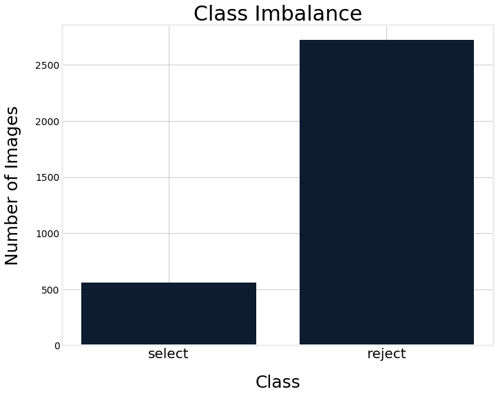
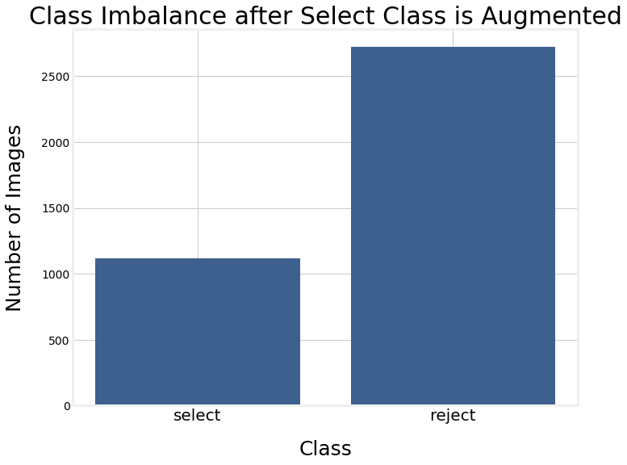
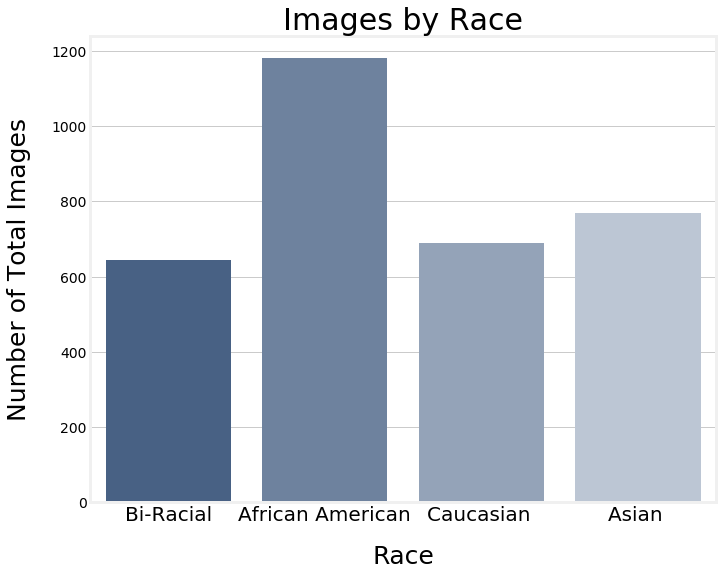
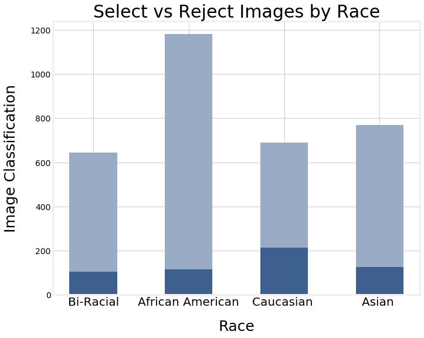
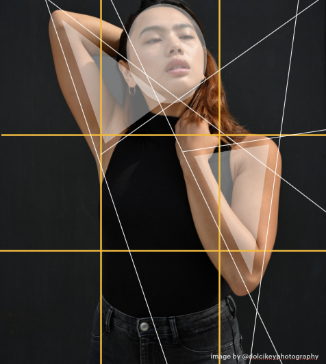

# PostSelectML 
## A Machine Learning based rating tool for selecting your most ideal raw images so you don't have to. 

### Created by Dolci Key Sanders

## Background 

Having come from a background of both photography and fashion, I have spent a considerable amount of time both behind and infront of the camera. My grandfather was a photography professor and I grew up with a film camera in hand. My grandad was one of the first of his generation to embrace the digital age in photography and started experimenting with digital images when I was in high school. He often looked through my images, critiquing the framing or sometimes prasing the balance of the image or sharp focus. In film photography, image selection happened after film was developed, but in the digital age, after images are downloaded, images go through a process called selection, sometimes even multiple rounds of selection before final images are choses, edited, and exported. This process can take hours and is a pain-staking process, or was. Until now. 

The idea behind this model is that once trained with a vast amount of knowlege to intepret and analyze photography, this Convelutional Neural Network will be able to take a set of raw (.NEF) images before editing and select the images having a probability of idealness of 90% or above. Once selected, you can take those images and directly start editing. Saving hours, time, and money. 

## Business Case

Many businesses rely on content for marketing in the form of photographs. From E-commerce sites, to social media driven businesses, to smaller businesses like wedding photographers, these businesses all rely on a steady stream of photographic content. 

### Usual photography work flow
#### Shoot > Download images > Selection Process > Potential Secondary Selection Process > Edit Images > Export/Deliver to Client

During the post shoot process, after images are downloaded, many photographers spend hours sorting through hundreds or thousands of images during what is called the selection process. Similar to data science, this can be an iterative process with multiple reviews of the photos for selection. Some businesses and photographers have assistants or interns sort through these images. PostScriptML aims to minimize time spent in the pre-selection and selection processes using a convelutional neural network to filter images and return back the images that meet a certain probability of "idealness" in order to move on to the editing process. 

PostSelectML can minimize time spent on processing by making the selection process an unsupervised task saving time, money, and minimizing the probability of rejecting a great image. 

## Repository Navigation 
Here are all the files found in the PostSelectML Repository.

- README.md 
	- You are Here 
	- General Overview of the Repository

- 01_Data_Process_EDA.ipynb 
	- Data Preparation and EDA Notebook, includes visualizations of the break down of the data

- 02_Modeling_AWS_Sagemaker.ipynb 
	- Model coding notebook, function for running the modeling scripts in AWS SageMaker

- 03_Modeling_Local.ipynb 
	- Model coding notebook, function for running the best models

- 04_Modeling_Local_Further_Augmented.ipynb 
	- Further augmenting the data to see if models improve and reduce overfitting

- SCRIPTS 
	- model coding scripts and models

- VISUALS 
	- PNG files of all visuals in the EDA and Modeling Notebooks
	- Other visuals found in the README from the presentation

- PostSelectML_Deck.pdf
	- Presentation Slides 

## Data

I used RAW .NEF (Nikon) images from my archived shoots as well as incorporating 4 new shoots specifically for this project. All images used with the models' consent for this project. The two classes for these images are select (selected) and reject (rejected). 

Data Considerations

1. Class Imbalance

	To deal with class imbalance, all images of the selects sets were augmented by flipping them horizontally. This allowed the image to be different, but the same image to help boost the selected class. 

	

	Due to the nature of selects, there is often a large class imbalance when it comes to selected images verses the rejected images. This set was no different. Even with augmented images, this set is still very imbalanced, so using weighting methods in Keras also helped mitigate the imbalance issues. 

	  

2. Racial Bias 
	
	To minimize any potential racial bias of the model, I was able to include a mix of Caucasion, Dominican, African American, Asian, and bi-racial (Asian-Hispanic) models. 

	 

3. Image Size
	
	The nature of .NEF files is that they are 14 bytes to a pixel making for large images. These are the images that professional photographers use to keep all data in an image for editing. Once edited, the image is then compressed via the exporting process to a .jpg or other file type depending on its intended usage. 

	Images in this data set in their RAW form ranged from 9.6 MB to 65.5 MB. All but one set of images came from a Nikon Z7 camera using a XQD memory card, the smaller set from a Nikon D90 using a SD memory card. The smallest set was used in the validation set. 

	Images were stored using an S3 bucket for use in a SageMaker Notebook Instance where the modeling took place. Images were presorted into test, train, and validation folders where each subject(human model) was isolated to only one folder to prevent data leakage. 

	The total data size for all images was 186.64, so these I batch compressed using Capture NX-D to 500 pixels by 300 pixels before moving forward to save time in uploading and modeling.

4. Personal/Artistic Bias
	
	As I have personally selected what I believe to be most ideal for the data, there could be some artistic bias included in this model. I mainly focused on balance, eye focus, rule of thirds, and symmetry to make decisions on wether or not the photo should qualify as selected. Artistically blurry photos were not included as ideal, and photographers who are more artistic with movement may not benefit from this model. However, most photographers in business cases are looking for similar elements for their clients wether in portrait photography, advertisments, or e-commerce.  

	

# The Process 

First, I began by gathering data. I did this by gathering .NEF files, creating more images by doing additonal shoots to supplement my data, and sorting through to label the select and reject classes. Once done, I broke the shoots up into training, test, and validation sets.

## Data Preparation and EDA 

	Images were taken in .NEF raw form. They were labeled select or reject. 
	Once labeled, images were compressed in a batch process using Nikon Capture NX-D.

	Visualizations of class imbalance, subject models by race. 

	Connected an AWS S3 bucket from to import test, train, and validation files. 
	Augmentation of the selects by horizontally flipping each image using Keras in the model scripts. 

## Modeling

Amazon SageMaker coding and script writing referenced and based off a tutorial by Paul Breton.
	
	AWS SageMaker Notebook using an m4.xlarge instance. 

	
	Metrics

		- Recall 
			- I would rather have some bad images predicted to be good than vice versa as that would risk tossing out a good photo

		- Accuracy 
			- Binary Accuracy (default accuracy measure in Keras for binary classification)

		- Loss Function
			- Aiming to minimize the loss score
			- Specifically used Binary Cross Entropy

## Modeling Evaluation 

AWS

Model | Binary Accuracy | Loss
------------ | ------------- | ------------
AWS vanilla_model.py | 0.9375 | 1.00189
model_script_ii.py| 0.90625 | 0.38386
model_script_iii.py | 0.9375 | 0.34514

In the first few models I as able to run, the vanilla model was very high for Binary Accuracy, but this did not take into account the recall metric on AWS. 

I worked on minimizing loss by adding tuning metrics such as recall and f1_score into the training process to minimize false negatives. I would rather edit one rejected photo than lose out on a photo that should have been selected. 

Local Models 

Model | Loss | Binary Accuracy | Recall
------------ | ------------- | ------------
vanilla_model | .480 | .837 | 0
weighted_vanilla | .556 | .720 | 0.176
vanilla_aug | .485| .837 | 0
model_script_vi_aug | .710 | .1625 | .1625

# Reproduction Instructions

Amazon Web Services

Create an S3 Bucket with 'sagemaker-' as the prefix. 
	- load in your images. (This data set is not available publically due to usage agreements)

Create a SageMaker notebook instance, before creating, scroll down to connect your github repo during this configuration. Please note that the instance size will depend based on the data you are using for modeling.

Once these are set up, launch Jupyter Labs and the github repo should appear.
Connect the S3 bucket using the code in the 002 Modeling notebook. 

Use the function in the Modeling notebook to run .py file scripts. 
Please note any libraries used must be included in the scripts, or they will throw an error. 
Make sure to include 'import os' when importing libraries in the script. 

# Conclusion and Future Steps 

The baseline model preformed much better than expected in training AWS, and I was able to minimize the loss within the first couple of models, however, the model did preform well during prediction, likely due to the class imbalance. I think this shows that the potential for this model is very high, and that this could work for a business case. 

--I did have issues with recall metrics in Keras, on the hold out set, often the recall would be noted as 1 or 0, or very low 0.012 etc. Further exploration will be needed to resolve this issue. 

I did run into issues with needing more people/diversity and images due to not wanting any models to be repeated in the train, test, and validation images. I plan to add a couple more photo sessions into the data and see if this helps fix that issue. I think due to the small data, this also had an impact on the preformance.  

Local modeling was able to weight the classes, and also show recall metrics. This helped immensely, although the model tends to overfit quickly. Additional modeling and data should help increase model preformance.  

## Image Size

I would like to be able to include code to compress a .NEF image so that .NEF images could be automatically fed into the model, but for this model which is more proof of concept, compressed images were needed due to fime and hardware constraints. 

## Apps and Software Development 

I would like to further expand this model into an app and also eventually work towards building software that can be integrated into a camera for real time analysis of angles, framing, and balance. 

## Additional Sources: 

Photographs by Dolci Key Photography

Image Subjects (Models) without whom, this data would have been hard to find elsewhere:
- Kristen Heavey @kristenheavey
- Samayah Jaramillo @samayahjaramillo
- Bethany Chasteen @officialchasteen
- Joanna Pauline @thejoannapauline

Image Storage by AWS S3 Buckets
Modeling powered by AWS SageMaker 

Modeling AWS script based on Paul Breton's AWS SageMaker Article on Medium. 
https://blog.betomorrow.com/keras-in-the-cloud-with-amazon-sagemaker-67cf11fb536

Thank you to Aren Carpenter for help troubleshooting the S3 code and modeling errors. 

